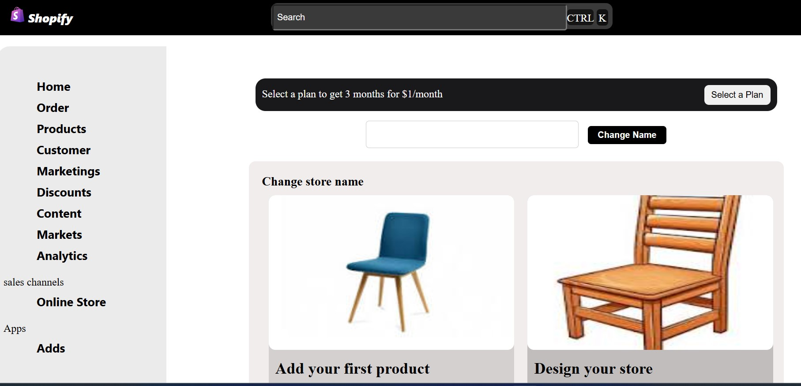

This is a basic Shopify clone built using HTML, CSS, and a little JavaScript.
It is a static project with no backend and all files (HTML, CSS, JS, images) are in the same folder.
This project demonstrates the layout and functionality of a simple e-commerce website similar to Shopify.

Features
Responsive design using CSS

Navigation bar with links

Product listing with images, titles, and prices

Add to Cart button (basic functionality using JS)

Footer section with social links and info

Folder Structure
php
Copy
Edit
shopify-clone/
│
├── index.html          # Main HTML file
├── style.css           # CSS file
├── script.js           # JavaScript file (optional)
├── product1.jpg        # Product images
├── product2.jpg
├── logo.png            # Logo image
└── ...                 # Any other images or assets
Note: All files are in the same folder, no src folder is used.

How to Run
Download or clone the project to your local machine.

Open index.html in your web browser.

You should see the Shopify-like layout and be able to interact with buttons.

Technologies Used
HTML

CSS

JavaScript (minimal)

Images stored locally

Customization
Replace the images in the folder with your own products.

Edit index.html to add more products or sections.

Modify style.css to change colors, fonts, and layout.

Add JavaScript code in script.js for more interactivity.

Screenshot

